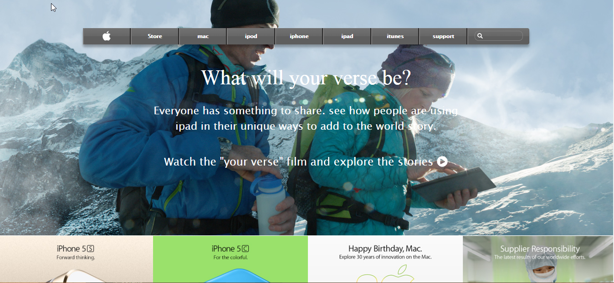

# clone-of-apple.com

## what it does
It is the frontend clone for the apple.com old page. The page have icons and apple phones which have validation features made through the HTML. There are buttons on the page with icons and text in them directing the user to carry out actions that include signing up signing in,Users are able to search anything regarding apple.

## Built With
HTML

CSS

Font Awesome

## screenshoot

## [Live demo project](https://rawcdn.githack.com/nellencr/clone-of-apple.com/5603a43bbdd4107e957aebecd02a38b4f160353a/index.html)

## Getting Started

You may use the following steps to get a local copy:

-Clone project to your local machine 

-cd to the project directory 

-Open project in IDE Open Live Preview through IDE or

-use localhost to view the project in your browser

**Contributing**

You are welcome to make contributions to the repository. Contributions may be made through issues comments and feature requests.

You may find the issues page [here](https://github.com/nellencr/clone-of-apple.com/issues)

 ## Author
 
Nela GitHub: @nellencr

Linkedin: Nela komane
# Clone of old Apple.com page

